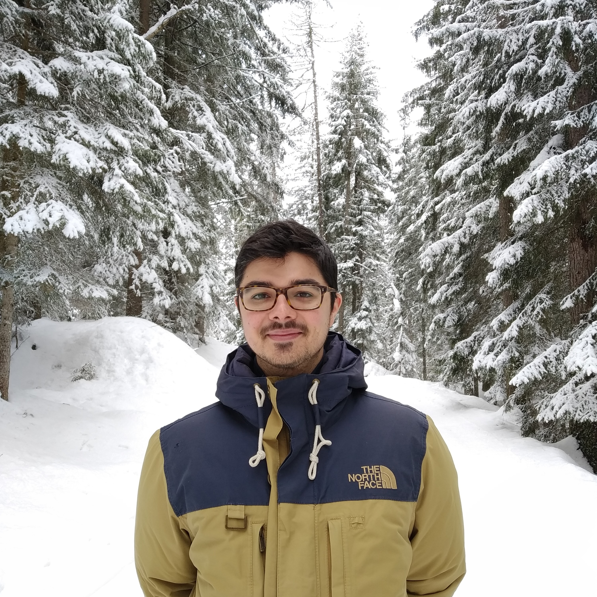

---
# Feel free to add content and custom Front Matter to this file.
# To modify the layout, see https://jekyllrb.com/docs/themes/#overriding-theme-defaults

layout: default
---

# À propos

    

        
 
          Je suis actuellement Maître de conférences à <a href="https://www.sorbonne-universite.fr/">Sorbonne Université</a> et membre du laboratoire Jacques-Louis Lions (<a href="https://www.ljll.math.upmc.fr/">LJLL</a>). Je travaille principalement sur des problèmes d'interaction fluide-structure avec des applications en sciences du vivant et sur le développement de méthodes numériques pour la résolution de problèmes aux interfaces.
           
          <b>Contact :</b>
          fabien.vergnet[at]sorbonne-universite.fr
        

        
  

    

## Thèse de doctorat [[Tel]](https://tel.archives-ouvertes.fr/tel-02194265v1)
J'ai soutenu une thèse en mathématiques appliquées au Laboratoire de Mathématiques d'Orsay ([LMO](https://www.math.u-psud.fr)) qui porte sur la modélisation, l'analyse mathématique et la simulation numérique de structures actives dans un fluide de Stokes. Ce travail a été réalisé sous la direction d'[Astrid Decoene](http://www.math.u-psud.fr/~decoene/), de [Sébastien Martin](http://w3.mi.parisdescartes.fr/~smarti02/) et de [Bertrand Maury](http://www.math.u-psud.fr/~maury/).

# Recherche

## Thèmes de recherche

- Modélisation en sciences du vivant et physique.
- Analyse de problèmes d'interaction fluide-structures.
- Développement de méthodes numériques pour la résolution d'EDP.
- Calcul scientifique.

## Publications scientifiques

**Pré-publications**

* Céline Grandmont, Fabien Vergnet.  
**Existence and uniqueness for a quasi-static fluid-structure interaction problem with an active structure**  
Accepté dans *Journal of Mathematical Fluid Mechanics* (2020). [[Hal]](https://hal.archives-ouvertes.fr/hal-02493384v1) 

* Astrid Decoene, Sébastien Martin, Fabien Vergnet.  
**A continuum active structure model for the interaction of cilia with a viscous fluid.**  
*Pré-publication, 29 pages* (2020). [[Hal]](https://hal.archives-ouvertes.fr/hal-02493513v1)

* Astrid Decoene, Sébastien Martin, Fabien Vergnet.  
**A smooth extension method for transmission problems.**  
*Pré-publication, 34 pages* (2019). [[Hal]](https://hal.archives-ouvertes.fr/hal-02146271v2)

**Dans des journaux scientifiques avec comité de lecture**

0. Sergio Chibbaro, Astrid Decoene, Sébastien Martin, Fabien Vergnet.  
**Irreversibility and chaos in active particles suspensions.**  
*Physical Review Fluids* 6:1 (2021). [[Article]](https://doi.org/10.1103/PhysRevFluids.6.013104) [[arXiv]](https://arxiv.org/abs/2005.10613)
 
0. Pierre Degond, Sara Merino-Aceituno, Fabien Vergnet, Hui Yu.  
**Coupled Self-Organized Hydrodynamics and Stokes models for suspensions of active particles.**  
*Journal of Mathematical Fluid Mechanics* 21:6 (2019). [[Article]](https://rdcu.be/bjyha) [[arXiv]](https://arxiv.org/pdf/1706.05666.pdf)
{: reversed="reversed"}

## Exposés scientifiques

**Présentations orales**

- Séminaire de l'équipe COMMEDIA de l'INRIA Paris, en visioconférence, 23 novembre 2020.
- Séminaire équations aux dérivées partielles, IRMA, Strasbourg, 11 février 2020.
- Groupe de travail Bio-Maths, Institut Denis Poisson, Orléans, 28 novembre 2019.
- Séminaire du CMAP, CMAP, École Polytechnique, Palaiseau, 19 novembre 2019.
- 9e Congrès SMAI, Guidel Plages, 13-17 mai 2019.
- 18e Forum des Jeunes Mathématiciennes et Mathématiciens, Orléans, 28-30 novembre 2018.
- Séminaire d'Analyse Numérique et Calcul Scientifique, LMB, Université de Franche-Comté, Besançon, 15 mars 2018.
- Laboratoire d'Hydraulique Saint-Venant, Chatou, 8 mars 2018.
- Groupe de Travail des Thésards et Jeunes Docteurs, MAP5, Université Paris Descartes, Paris, 13 février 2018.
- Groupe de Travail des Doctorants, Institut Elie Cartan, Université de Lorraine, Nancy, 6 février 2018.
- Biennale des Mathématiques Appliquées et Industrielles (SMAI 2017), Ronce-les-Bains, 5-9 juin 2017.
- Séminaire Analyse numérique et EDP, LMO, Université Paris-Sud, Orsay, 4 mai 2017.
- 19h International Conference on Finite Elements in Flow Problems, Rome, 5-7 avril 2017.

**Posters dans des congrès**

- VIème Colloque EDP-Normandie, Caen, 25-26 octobre 2017.
- 43ème Congrès National d'Analyse Numérique, Obernay, 9-13 mai 2016.

## Codes de calcul scientifique

- [[CAFES]](https://github.com/gouarin/cafes) Cartesian Finite Element Solver. Code de calcul écrit en C++ et utilisant la librairie PETSc pour la simulation d'écoulements de fluides à faible nombre de Reynolds contenant des particules rigides.

# Enseignement

**À Polytech Sorbonne \| 2020-21**
- Analyse numérique et EDO. Parcours Mathématiques Appliquées et Informatique. 1ère année. Cours, TD et TP

**À l'UFR de Mathématiques et d'Informatique de l'Université Paris-Descartes \| 2018-19**
- Phénomène de transport en biologie. M2 MM. Cours, TD et TP : 2018-19 (18,5h)
- Transformée de Fourier. L3 mathématiques. TD : 2018-19 (72h)
- Mesure et intégration. L3 mathématiques. TD : 2018-19 (36h)
- Algèbre linéaire. L2 mathématiques. TD : 2018-19 (36h)

**À L'UFR des Sciences de l'Université Paris-Sud | 2015-18**
- Algèbre linéraire. L3 mathématiques. TP : 2015-16 (16h) \| 2016-17 (16h) \| 2017-18 (22h)
- Introduction à Python. L3 mathématiques. TP : 2015-16 (12h) \| 2016-17 (12h)
- Calcul scientifique. L3 mathématiques. TP : 2015-16 (18h) \| 2016-17 (18h)
- Introduction à la simulation numérique. L2 mathématiques. Cours et TP : 2015-16 (15h) \| 2016-17 (15h) \| 2017-18 (42h)

**Encadrement d'étudiants**
- Tomas Fullana (L3). Numerical simulations of fluid-structure problems. Application to the mocuciliary transport. (Juin-Juillet 2017)
