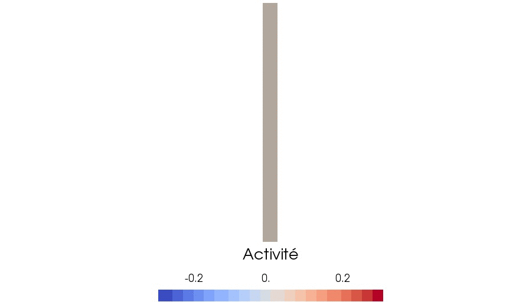

[< Retour](index.html)

# Quelques simulations numériques

Sur cette page sont présentées quelques simulations numériques directes pour des problèmes d'interaction fluide-structure avec des structures actives. Elle ont été réalisées avec la librairie [FEniCS](fenicsproject.org). 

## Modélisation de structures actives

|  |
|:--:|
| *Résolution des équations de l'élasticité active pour une activité interne engendrant des déformations à courbure constante le long de la structure. Tiré de [[1]](#bib1)*. |

|  |
|:--:|
| *Résolution des équations de l'élasticité active pour un scénario d'activité engendrant des déformations ressemblant à celles des cils bronchiques. Tiré de [[1]](#bib1)*. |

## Couplage Stokes-élasticité active

|  |
|:--:|
| *Deux cils (structures élastiques actives) battant dans un fluide de Stokes. Tiré de [[1]](#bib1)* |

## Méthode de prolongement régulier

|  |
|:--:|
| *Structure élastique linéaire passive dans un fluide de Stokes en cisaillement. Simulation réalisée avec le méthode de prolongement régulier présentée dans [[2]](#bib2) qui permet l'utilisation de maillages non conformes pour le fluide et la structure.* |

### Références

[1] Astrid Decoene, Sébastien Martin, Fabien Vergnet. A continuum active structure model for the interaction of cilia with a viscous fluid. Pré-publication, 29 pages (2020). [[Preprint]](https://hal.archives-ouvertes.fr/hal-02493513v1)
{: #bib1}

[2] Astrid Decoene, Sébastien Martin, Fabien Vergnet. A smooth extension method for transmission problems. Pré-publication, 34 pages (2019). [[Preprint]](https://hal.archives-ouvertes.fr/hal-02146271v2)
{: #bib2}

